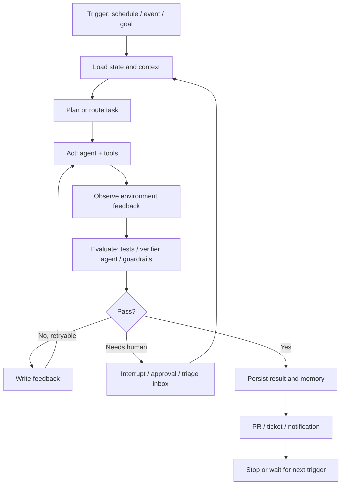

# Agent 领域 Loop Engineering 调研

日期：2026-06-15

## 结论先行

Loop Engineering 不是一个全新的模型能力，而是一种把 Agent 使用方式从“人一轮一轮提示”升级为“系统自动发现任务、调用 Agent、验证结果、记录状态、决定继续或停止”的工程方法。它更接近一个小型控制系统：触发器负责叫醒任务，Agent 负责执行，工具和连接器接入真实环境，独立评估器负责验收，持久状态负责跨轮记忆，人类保留审批、最终验收和方向判断。

当前比较热的做法可以概括为：

1. 用自动化或事件触发让任务自己启动，而不是靠人手动开会话。
2. 用 worktree、沙箱、队列和权限边界隔离并行 Agent。
3. 用 Skills、项目规则、工具说明和记忆文件沉淀上下文，减少每轮重复解释。
4. 用 MCP、函数工具、CI、Issue、PR、数据库、通知系统把 Agent 接入真实工作流。
5. 用“执行者 Agent + 独立评估者 Agent + guardrails + human-in-the-loop”形成可验收闭环。
6. 用 checkpoint、store、session、状态文件、看板记录跨轮状态，防止每次从零开始。
7. 用 tracing、成本预算、最大迭代数、成功标准和人工刹车避免 loop 失控。

## 三篇微信文章摘要

### 1. 《深度拆解：到底什么是 Loop Engineering？落地必看的 6 大核心组件》

来源：https://mp.weixin.qq.com/s/fC35w-Frg4nBsPeNDRO8Gw

文章把 Loop Engineering 描述为 AI 编程协作的下一层抽象：2023 年是补全，2024 年是提示写代码，2025 年是并行 Agent，2026 年开始转向“写能自动提示 Agent 的循环系统”。它强调人的位置从循环内部的提示者，移动到循环外部的系统设计者。

文中提出六个核心组件：

- 自动化：用定时、事件、CI 失败、Issue 更新等触发 loop。
- 工作树：用 git worktree 等机制让多个 Agent 并行但互不覆盖。
- 技能：把项目规范、构建命令、踩坑记录、PR 模板等写成可复用知识。
- 连接器：通过 MCP 等协议接入 Jira、Slack、数据库、GitHub 等外部系统。
- 子智能体：把“生产者”和“检查者”分开，避免 Agent 自评过宽。
- 记忆：把状态写到磁盘、看板或知识库中，不能只放在上下文窗口里。

它还特别提醒三个坑：Token 成本失控、虚假完成、代码库理解失控。文章的价值在于把 loop 从口号拆成了工程部件。

### 2. 《提示词工程已死，Loop Engineering 来了！》

来源：https://mp.weixin.qq.com/s/dHbJ3Z2sNebMAOlQXPYiDQ

这篇文章基于 Addy Osmani 对 Loop Engineering 的阐释，核心观点是：真正消耗人的不是第一句提示词，而是后续大量重复动作，包括发现问题、拆任务、检查、记录、继续推进。Loop Engineering 的目标就是把这些反复发生的动作设计成闭环。

文章用六个问题解释 loop：

- 谁来叫醒它？
- 多个 Agent 并行时怎么隔离？
- AI 怎么知道团队平时怎么干活？
- 它能否访问本地资料和外部工具？
- 谁来检查输出？
- 它怎么记住昨天做到哪？

它对边界的判断比较稳健：loop 不是把人拿掉，而是把人从重复推动流程中抽出来，但判断、验收、刹车仍然必须留在人手里。

### 3. 《一文读懂什么是 Loop，Claude Fable 5 是 Loop 最严厉的父亲》

来源：https://mp.weixin.qq.com/s/ALuFleuLG6_fBlnn5Jnlnw

这篇文章延续同一套组件拆解，但加入了更多产品视角，重点比较了 Claude Code 和 Codex 在自动化调度、worktree、Skill、MCP、子 Agent、记忆机制上的相似性。它把 loop 解释为“递归目标”：定义目的，系统持续迭代直到条件满足。

文章还讨论了第三方提到的 Claude Fable 5 / CMA / Outcomes 自校正实验，强调“谁来评分”很重要：独立验证子 Agent 通常比自我评价更可靠。这个论点与 Anthropic 和 LangGraph 官方文档里的 evaluator-optimizer 模式相互吻合。不过，文中涉及 Fable 5 实验细节和社交媒体链接，本文将其视为需要进一步核验的行业观察，不把它作为工程落地的主要证据。

## 一手资料校准

### Addy Osmani：Loop 是 Harness 之上的系统层

Addy Osmani 原文《Loop Engineering》给出的定义是：不再由人直接提示 Agent，而是设计一个系统替人去提示 Agent。它把 loop 放在 agent harness 之上一层：harness 关注单个 Agent 运行环境，loop 则关注定时触发、任务分发、辅助 Agent、状态回写和持续推进。

原文列出的五个部件加一个记忆机制，与三篇微信文章基本一致：Automations、Worktrees、Skills、Plugins / Connectors、Sub-agents，以及外部状态。

来源：https://addyosmani.com/blog/loop-engineering/

### Anthropic：主流 agent pattern 是 loop 的底层积木

Anthropic《Building effective agents》把 agentic systems 分成 workflows 和 agents：

- Workflows：LLM 和工具按预定义代码路径被编排。
- Agents：LLM 动态决定流程和工具使用方式。

文中列出的 prompt chaining、routing、parallelization、orchestrator-workers、evaluator-optimizer、autonomous agent，正是 loop engineering 的常见底层模式。尤其 evaluator-optimizer，即一个 LLM 生成，另一个 LLM 评估并反馈，天然就是“执行-评价-再执行”的闭环。

Anthropic 也强调：不要一上来堆复杂框架。应先用最简单的方案，只有当复杂度能显著改善结果时再引入 agentic system。Agent 会带来更高延迟、成本和复合错误风险，需要沙箱、测试和 guardrails。

来源：https://www.anthropic.com/research/building-effective-agents

### LangGraph：把 loop 显式建成图、状态和条件边

LangGraph 官方文档把 workflow / agent pattern 落到图结构：

- prompt chaining：顺序节点 + 中间 gate。
- routing：先分类，再进入专门路径。
- parallelization：并行分支 + 聚合。
- orchestrator-worker：中心编排者动态创建 worker。
- evaluator-optimizer：生成器和评估器循环，直到通过。
- agent loop：LLM 决定是否调用工具；有工具调用就执行工具再回到 LLM，没有工具调用就结束。

LangGraph 的 persistence 也非常关键：checkpointer 负责单线程短期状态，例如中断恢复、人审、容错；store 负责跨线程长期记忆，例如用户偏好、事实和共享知识。interrupts 则把 human-in-the-loop 做成可暂停、可恢复的机制。

来源：

- https://docs.langchain.com/oss/python/langgraph/workflows-agents
- https://docs.langchain.com/oss/python/langgraph/persistence
- https://docs.langchain.com/oss/python/langgraph/interrupts

### MCP：连接器层正在标准化

MCP 的定位是让 AI 应用以标准方式连接外部系统，包括本地文件、数据库、搜索引擎、业务系统和可复用 prompts。对 loop 来说，MCP 解决的是“Agent 如何进入真实环境做事”的问题。

没有连接器，loop 只能在文件系统里给建议；有连接器后，它可以读 Issue、查日志、跑 CI、开 PR、更新看板、通知频道。也正因为如此，MCP 工具必须配合权限、审批、审计和最小暴露原则。

来源：

- https://modelcontextprotocol.io/docs/getting-started/intro
- https://openai.github.io/openai-agents-python/mcp/

### OpenAI Agents SDK：生产化 loop 的几个关键原语

OpenAI Agents SDK 官方文档把 agent loop、handoffs、guardrails、sessions、tracing、MCP 都作为核心能力：

- Agent loop：运行时处理工具调用，把结果回传给 LLM，持续运行直到任务完成。
- Handoffs：一个 Agent 可把任务交给另一个专门 Agent。
- Guardrails：对输入、输出、工具调用做验证和拦截。
- Sessions：跨多次 agent run 保存会话历史。
- Tracing：记录 LLM 生成、工具调用、handoff、guardrail、自定义事件，用于调试、监控和评估。
- MCP：复用 MCP server 或构建自己的工具/上下文暴露方式。

这些原语说明 loop engineering 正在从“手写脚本经验”变成框架和 SDK 的标准运行时能力。

来源：

- https://openai.github.io/openai-agents-python/
- https://openai.github.io/openai-agents-python/handoffs/
- https://openai.github.io/openai-agents-python/guardrails/
- https://openai.github.io/openai-agents-python/sessions/
- https://openai.github.io/openai-agents-python/tracing/

## Loop Engineering 的典型架构

## 现在常见的 loop 设计模式

### 1. 目标驱动 loop

适合“成功条件清晰，但中间步骤不可预知”的任务。例如：“修复 `auth` 模块测试，直到 `pytest tests/auth` 和 lint 都通过”。关键是把退出条件写得机器可验证，而不是写成“修好它”。

核心要点：

- 成功条件必须在启动前定义。
- 设置最大迭代数、最大费用、最长运行时间。
- 每轮必须读取环境反馈，例如测试日志、构建日志、运行结果。
- 失败后把 evaluator 的反馈变成下一轮输入。

### 2. 定时巡检 loop

适合 CI 失败汇总、Issue triage、依赖升级检查、安全告警、日志异常摘要、每日研究简报。触发器通常是 cron、自动化任务或 GitHub Actions。

核心要点：

- 先做发现和分类，不要默认直接改代码。
- 只把高置信、低风险任务交给自动修复。
- 没发现问题的运行自动归档，有发现的进入 triage。
- 状态写回文件、数据库或看板，避免重复处理同一问题。

### 3. Orchestrator-workers loop

适合多文件改造、复杂调研、迁移任务。Orchestrator 负责拆解任务、分发给多个 worker，再聚合结果。

核心要点：

- worker 必须有独立输入和边界，避免互相踩文件。
- 对代码任务用 worktree 或沙箱隔离。
- 聚合阶段要做冲突检测、重复检测和一致性检查。
- 人的 review 带宽通常是瓶颈，不是 Agent 数量。

### 4. Evaluator-optimizer loop

适合有明确评分标准且迭代会变好的任务，例如代码修复、翻译润色、测试生成、文档质量检查、研究资料补全。

核心要点：

- 生成器和评估器分离。
- 评估器使用结构化输出，例如 pass/fail、问题列表、置信度、下一步建议。
- 尽量引入客观信号：测试、lint、schema validation、benchmark、数据校验。
- 评估器不能只说“看起来不错”，必须输出可执行反馈。

### 5. Agent tool-use loop

适合路径不可提前写死的任务。Agent 每轮决定是否调用工具；调用工具后读取 observation，再决定继续或结束。

核心要点：

- 工具说明要像 API 文档一样清楚，包括参数、边界、错误格式、示例。
- 危险工具要加审批，例如删除、发版、付款、写数据库、外部通知。
- 工具输出要结构化，方便后续判断。
- 最好把 tool traces、参数、结果、耗时都记录下来。

### 6. Human-in-the-loop loop

适合需要责任边界的任务，例如生产数据库改动、用户可见文案发布、合并大 PR、安全敏感操作。

核心要点：

- 在关键节点暂停，而不是事后补救。
- 暂停时提供简洁上下文：准备做什么、为什么、风险、可选动作。
- 恢复后继续同一 thread/checkpoint，避免重新推导。
- 人类审批结果也要写入状态，供后续 loop 学习边界。

## 落地实施清单

### 第一步：选任务

优先选择满足这些条件的任务：

- 重复发生。
- 流程相对稳定。
- 有可验证反馈。
- 失败代价可控。
- 人现在主要在做推动、检查、记录，而不是创造性判断。

不适合一开始做 loop 的任务：

- 成功标准含糊。
- 需要大量隐性业务判断。
- 一次性任务。
- 失败会造成不可逆损失。
- 没有测试、日志、审批或回滚机制。

### 第二步：写状态模型

最小状态可以是一个 Markdown 或 JSON 文件，至少包含：

- loop 名称和目标。
- 本轮输入来源。
- 已处理事项。
- 当前阻塞事项。
- 尝试过的方案。
- 验证结果。
- 下一步动作。
- 人类审批记录。
- 最后更新时间和运行 ID。

成熟后可以迁移到数据库、Linear/Jira、LangGraph store、SDK session 或内部任务系统。

### 第三步：定义退出条件

好的退出条件示例：

- 所有目标测试通过，lint 无错误，且 diff 只触及允许目录。
- 生成的报告包含至少 8 个来源，每个来源有 URL 和摘要，且重复率低于阈值。
- Issue 被分类到明确标签，置信度低于 0.7 的进入人工队列。

差的退出条件示例：

- 做到最好。
- 修好所有问题。
- 输出高质量结果。
- 自动判断是否完成。

### 第四步：拆角色

常见角色组合：

- Triage Agent：发现、分类、排序。
- Planner Agent：拆解任务和选择策略。
- Executor Agent：执行代码、写文档、调用工具。
- Verifier Agent：跑测试、读 diff、对照规格。
- Security/Policy Agent：检查敏感操作和合规边界。
- Summarizer Agent：写状态、PR 摘要、日报。

不必每个 loop 都上全套。小任务从 Executor + Verifier 开始即可。

### 第五步：接工具

代码类 loop 常接：

- git / worktree / branch / PR。
- test / lint / typecheck / build。
- CI 日志。
- Issue tracker。
- code search。
- package manager。

业务类 loop 常接：

- 数据库只读查询。
- CRM / 工单系统。
- Slack / 飞书 / 邮件。
- 文档库 / 知识库。
- BI / 日志平台。

工具接入原则：

- 默认只读，逐步开放写权限。
- 写操作前加审批。
- 每个工具有清晰 schema 和错误输出。
- 高风险工具加 allowlist 和审计日志。

### 第六步：加观测和成本控制

每次运行至少记录：

- run id。
- 触发原因。
- 使用模型。
- token / 费用估算。
- 工具调用次数和耗时。
- 迭代轮数。
- 最终状态：success / no-op / needs-human / failed。
- 失败原因。
- 产生的 diff、PR、通知或状态变更。

上线前设置：

- 最大迭代数。
- 最大 token 或费用。
- 最大运行时长。
- 最大并发数。
- 允许改动的目录。
- 需要人工审批的操作。

## 示例：CI 失败自动修复 loop

目标：每天检查主分支 CI 失败，自动尝试低风险修复，生成 PR 交给人 review。

流程：

1. 定时触发：每天 9 点读取昨晚 CI 失败记录。
2. 载入状态：读取 `agent-loop-state.md`，跳过已经处理过的失败。
3. Triage：按失败类型分类，例如测试 flake、依赖缺失、类型错误、真实回归。
4. 风险判断：只处理低风险、可复现、影响范围小的问题。
5. 隔离执行：为每个候选问题创建独立 worktree。
6. 修复尝试：Executor Agent 修改代码或测试。
7. 验证：Verifier Agent 跑目标测试、lint、必要时跑相关测试集合。
8. 审查：检查 diff 是否只触及允许范围，是否引入大规模重构。
9. 输出：通过则开 PR，失败则写入 triage inbox。
10. 记忆：记录尝试、结果、PR 链接、失败原因，供下一轮读取。

退出条件：

- 目标 CI 失败在本地复现并修复。
- 相关测试和 lint 通过。
- diff 在允许目录内。
- PR 已创建或任务进入人工队列。
- 达到最大 3 轮修复尝试后停止。

## 风险与反模式

### 1. 没有明确停止条件

这是最常见的成本黑洞。Loop 必须有成功、失败、暂停三类终止路径。

### 2. 让 Agent 自己验收自己

自评会系统性偏宽。至少要有独立 verifier，最好再叠加客观环境信号。

### 3. 只追求并发数量

并发 Agent 增加的是产出速度，也增加 review 压力、合并压力和理解债。worktree 只能解决文件碰撞，不能解决人的注意力瓶颈。

### 4. 把上下文全塞进提示词

长期知识应沉淀为 skill、文档、状态文件或 store。提示词只承载本轮目标和差异信息。

### 5. 工具权限过大

Loop 一旦能写数据库、删资源、发通知、合并代码，就必须有审批、审计和回滚。

### 6. 只看测试绿灯

测试通过不代表业务正确，也不代表人理解了变更。高价值代码仍需读 diff、看设计影响、控制理解债。

### 7. 状态不落盘

没有外部状态的 loop，本质上每次都重新开始，容易重复尝试、忘记失败原因、无法审计。

## 与 Prompt / Context / Harness Engineering 的关系

- Prompt Engineering：优化单次指令，让模型更好完成当前任务。
- Context Engineering：控制模型看到什么上下文，减少噪声并补足关键信息。
- Harness Engineering：设计单个 Agent 的运行环境，包括工具、文件系统、测试、权限、错误反馈。
- Loop Engineering：把触发、上下文、执行、评估、记忆、审批、停止条件串成闭环。

所以 Loop Engineering 不是替代 Prompt Engineering，而是把 prompt 变成系统里的一个部件。坏 prompt 放进 loop，只会更快地产生坏结果。

## 建议的落地路线

### 阶段 0：手动 loop

先用人工方式跑 3 到 5 次流程，把步骤、输入、判断、输出写下来。不要急着自动化。

### 阶段 1：半自动 loop

自动发现和摘要，但不自动改动。输出进入人工 inbox。目标是验证分类、摘要和状态记录是否可靠。

### 阶段 2：受限自动修复

只处理低风险任务，限制目录、限制工具、限制迭代数。所有写操作走 PR 或审批。

### 阶段 3：多 Agent 验证

引入独立 verifier、security reviewer、spec checker。把失败反馈结构化，形成 evaluator-optimizer。

### 阶段 4：生产化运行

接入 tracing、成本看板、审计日志、权限策略、回滚流程和定期人工 review。此时 loop 才算进入工程系统，而不是个人脚本。

## 判断一个 loop 是否健康

健康信号：

- 多数运行是 no-op、success 或明确 needs-human，而不是无限 retry。
- 每次失败都有可读原因。
- 状态文件能解释它上次做了什么。
- 成本曲线稳定。
- PR 小而可 review。
- 人类能快速理解它为什么这么做。
- 它能主动停下，而不是假装完成。

危险信号：

- 经常说完成但没有证据。
- 修改范围越来越大。
- 重复处理同一问题。
- 工具调用日志不可追踪。
- 每次都重新解释项目规则。
- 人已经不读它产出的 diff。
- 没人知道它什么时候会触发、会做什么。

## 参考资料

- Addy Osmani, Loop Engineering：https://addyosmani.com/blog/loop-engineering/
- Anthropic, Building effective agents：https://www.anthropic.com/research/building-effective-agents
- LangGraph, Workflows and agents：https://docs.langchain.com/oss/python/langgraph/workflows-agents
- LangGraph, Persistence：https://docs.langchain.com/oss/python/langgraph/persistence
- LangGraph, Interrupts：https://docs.langchain.com/oss/python/langgraph/interrupts
- Model Context Protocol, Introduction：https://modelcontextprotocol.io/docs/getting-started/intro
- OpenAI Agents SDK：https://openai.github.io/openai-agents-python/
- OpenAI Agents SDK, Guardrails：https://openai.github.io/openai-agents-python/guardrails/
- OpenAI Agents SDK, Handoffs：https://openai.github.io/openai-agents-python/handoffs/
- OpenAI Agents SDK, Sessions：https://openai.github.io/openai-agents-python/sessions/
- OpenAI Agents SDK, Tracing：https://openai.github.io/openai-agents-python/tracing/
- OpenAI Agents SDK, MCP：https://openai.github.io/openai-agents-python/mcp/
- 微信文章 1：https://mp.weixin.qq.com/s/fC35w-Frg4nBsPeNDRO8Gw
- 微信文章 2：https://mp.weixin.qq.com/s/dHbJ3Z2sNebMAOlQXPYiDQ
- 微信文章 3：https://mp.weixin.qq.com/s/ALuFleuLG6_fBlnn5Jnlnw

## 调研备注

本次调研抓取了三篇微信文章全文，并用 Firecrawl 检索和抓取了一手资料。OpenAI Codex 官方手册在本地网络重试后返回 403，因此本文没有把 Codex App 具体产品入口作为官方已核验事实；相关 Codex/Claude Code 对比主要来自 Addy Osmani 原文和微信文章，工程建议则尽量落在 OpenAI Agents SDK、Anthropic、LangGraph、MCP 这些可访问的一手文档上。
